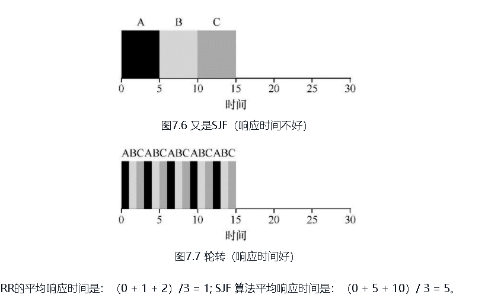
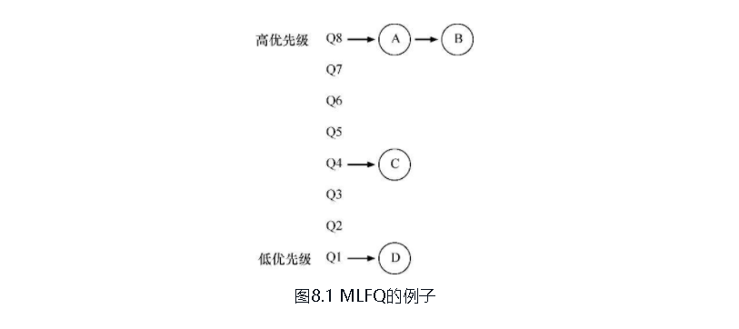
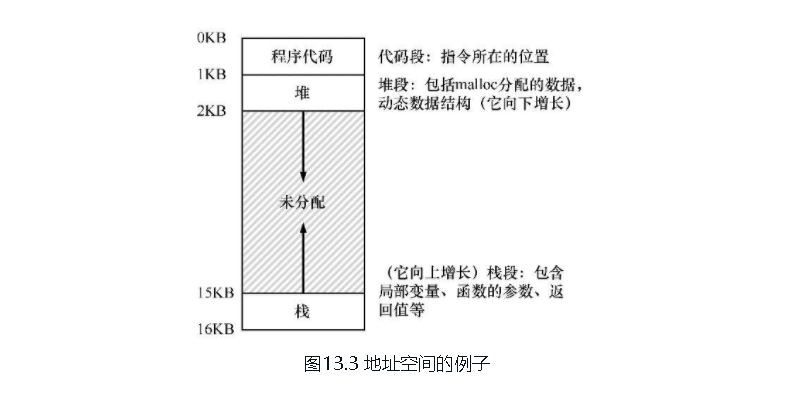
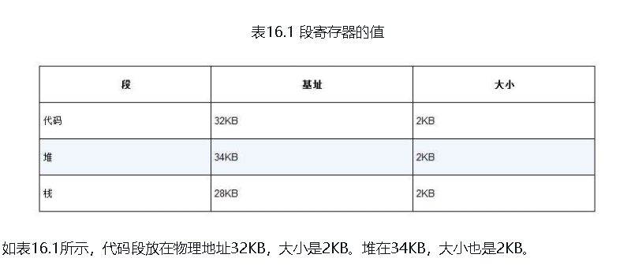
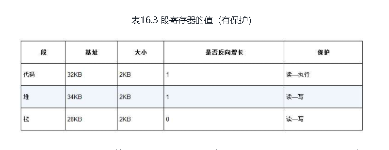
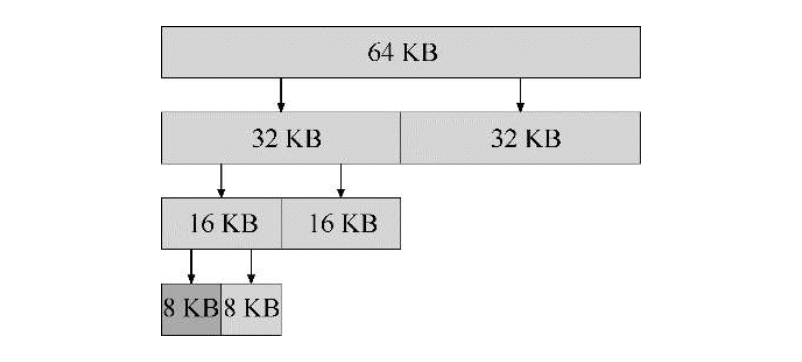
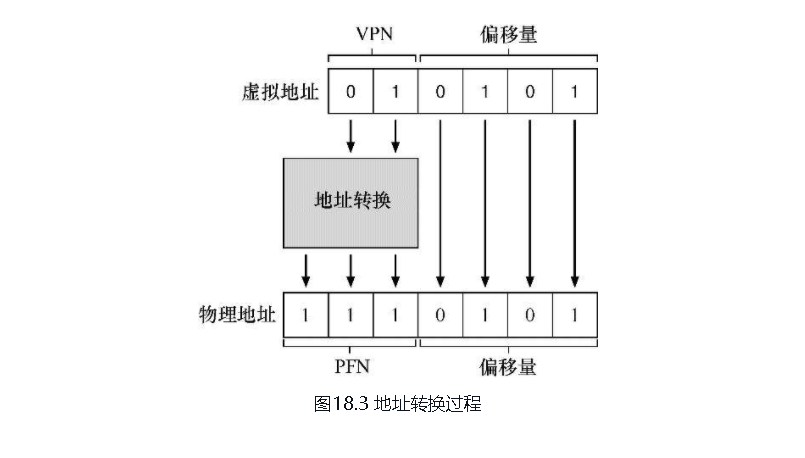
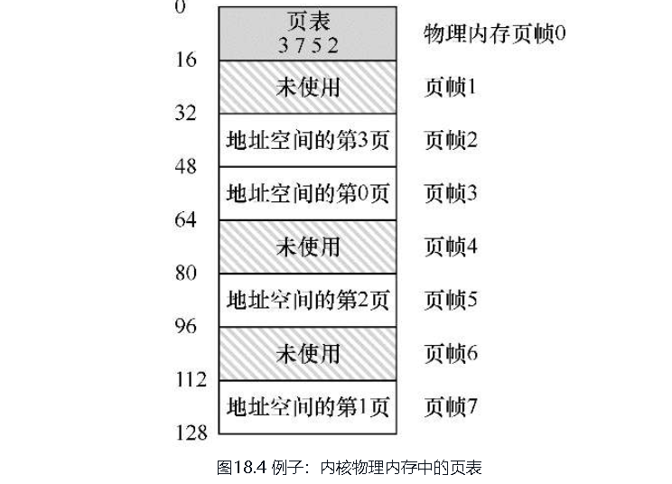
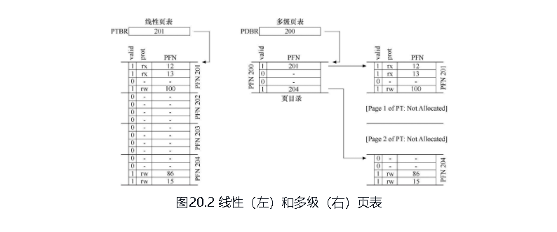

# 操作系统导论

---

## 虚拟化

### 抽象:进程

- 进程：操作系统为正在运行的程序提供的抽象。

- 进程的状态：
    1. 运行：进程正在处理器上运行
    2. 就绪：进程已经准备好运行，由于某种原因，操作系统选择不在此时运行
    3. 阻塞:一个进程执行了某种操作，知道发生其他事件时才会准备运行。IO等
    

- 进程切换
    协作方式：操作系统相信系统的进程会合理的运行，运行时间长的进程，会自愿放弃CPU，以便操作系统可以执行其他任务。
    非协作方式：时钟中断，每隔一段时间，产生一次中断，此时正在运行中的进程停止，操作系统获得CPU的控制权，停止当前进程，并启动另外一个进程。

- 上下文切换:context switch
    操作系统为当前正在执行的进程保存一些寄存器的值，并为即将执行的进程恢复一些寄存器的值。

- 进程调度策略:
  
  - 假设 ：
  
    > 1. 每一个工作运行相同的时间
    > 2. 所有的工作同时到达
    > 3. 一旦开始，每个工作保持运行直到完成
    > 4. 所有的工作只是使用CPU
    > 5. 每个工作的运行时间是已知的
  
  - 评价指标:周转时间  T~周转~ = T~完成~ - T~到达~
  - 新度量指标：响应时间 T~响应时间~ = T~首次运行~  - T~到达时间~

1. FIFO (FCFS first come first server):先进先出，先来先服务

   A:10  B:20 C:30    T = (10+20+30)/3 = 20 平均周转时间 20

    >问题：极端情况下：A:100  B:10  C:10   T = （100+110+120）/3 = 110   ,A为长任务，BC必须等到A执行完后开始执行，对于BC的执行时间10 ，周转时间110 ，效率不高。  SJF(短任务优先)  解决FCFS的极端情况

2. SJF (最短任务优先)

   FCFS的极端情况： A:100  B:10  C:10      T~周转~ = 110
   SJF调度后： T~周转~ = （10 +20 +120）/3 = 50   由110 下降至50

   >问题：SJF 基于所有任务同时到达，是一个好的调度算法，放宽限制
   A:100  t=0   B:10  t=10   C:10  t=10
   BC 到达时，A已经在运行，根据假设三 ，T~周转~ = （100 +(110-10)+(120-10) ）/3 = 103.3  遇到了FCFS的极端问题
   STCF（最短完成时间优先）放宽假设三 ，工作可抢占

3. STCF(虽短完成任务优先)
  SJF是非抢占式的，STCF 抢占式(shortest time-to-completion first).新工作进入系统时，会确认剩余工作中和新工作中，谁的剩余时间最短，然后调度该工作。
  A:100  t=0   B:10  t=10   C:10  t=10
  
  T~周转~ = ((120-0)+(20-10)+(30-10))/3 = 50  // 非抢占式的SJF T~周转~ = 103.3 ,巨大提升

   >问题： 如果后续的工作一直是短任务，A任务将无法执行，提出响应时间的概念

4. 轮转（RR）：
  RR在一个时间片内运行一个任务，然后切换到运行队列中的下一个任务，而不是运行到一个任务结束 。RR反复执行，直到所有任务完成。
  A:5   B:5  C:5  t=0 同时到达，时间片1s
   时间片的长度对RR非常重要 . 时间片越短，RR 的响应时间越好，时间片过短会造成大量的上下文切换，影响整体的性能。
    >RR调度，注重的是公平，在效率上比较差.
    放宽上述假设4，5  有IO操作，作业时间未知
5. **MLFQ(multi-level feedback queue):多级反馈队列**

    >需要解决两个问题
    >
    >1. 优化周转时间
    >2. 降低响应时间

    基本规则：

    MLFQ拥有许多独立的队列，每个队列有不同的优先级。在任何时刻，一个工作只能存在于一个队列中，MLFQ总是优先执行较高  优先级的队列。

    对于队列的中任务，具有相同的优先级，采用RR进行调度 。
    >规则1：如果A 的优先级 > B 的优先级 ，运行A
    规则2：如果A的优先级 = B的优先级，RR调度运行AB

    

    尝试1：改变优先级
      >规则3 工作进入系统时，放在最高优先级队列 ，（假设新工作均为短任务）
    >规则4 工作用完整个时间片后，降低其优先级（移入下一级队列）
    >如果工作在其时间片内主动释放CPU ，则优先级不变  （优化IO任务的响应时间)

      问题：新工作一直是短任务或交互式任务，长任务得不到CPU执行，会产生饥饿。故意调用IO，影响调度公平。

      尝试2：在特定的时间间隔内，提升所有的工作。例如，全部提升到最高优先级的队列。保证长任务可以得到执行。
      > 规则5：经过一段时间S，将系统中所有的工作重新加入最高优先级队列。

      尝试3：更好的计时方式 。
      >规则4:（修改） 一旦工作用完了其在一层中的时间配额，就降低其优先级 。

    优化：不同的优先队列拥有不用的时间片。

6. 比列份额（彩票调度）and 步长调度  (使用较少)
彩票数代表进程（用户或其他）占有某个资源的份额.通过不断的抽取彩票,彩票调度从概率上获得这种份额的比例.

7. **多处理器的额调度**  TODO: 学习并发之后再阅读。

---

### 抽象：地址空间   CPU虚拟化

物理内存的抽象，叫做地址空间（address space）.

#### 机制：地址转换

地址转换:基于硬件的地址转换。利用地址转换，硬件对每次内存访问进行处理，将指令中的虚拟地址转换为数据实际储存的物理地址。

> 假设：
用户的地址空间必须连续的放在物理内存中，同时为了简单，我们假设地址空间小于物理内存大小。

方案1 ： 动态(基于硬件)重定位
> 每个CPU中需要两个硬件寄存器：基址寄存器（base） + 界限寄存器（bound）
一个基址寄存器将虚拟地址转换为物理地址，一个界限寄存器确保这个地址在进程地址空间的范围内

`physical addresss = virtual address + base`

#### 分段

>问题：我们假设将所有进程的地址空间完整的加载到内存中，利用基址和界限寄存器，操作系统将不同的进程定位到不同的内存。
存在大量的空闲空间,怎样支持大地址空间

分段：对于地址空间空的  代码，堆，栈三个不同的段，均分配一堆基址和界限寄存器 ，即段寄存器。

1. 假设有14位虚拟地址， 前两位标识 三个段 ，00 01  11  ，标识 code ，heap ，stack
对于堆而言，01 的基址加上偏移量，可以得到正确的地址

2. 对于栈而言，需要反向增长 ，11 .  11 1100 0000 0000  ，11 指代stack ，3kb是偏移量，为了得到正确的反向偏移量，我们从3kb中减去最大的段地址，得到反向偏移量 。物理地址 = 基址 +  反向偏移量

3. 支持共享：在地址空间之间共享某些内存段，需要增加保护位。

>问题：物理内存存在大量的小的空闲空间，很难分配给新的段，产生外部碎片。

利用空闲列表的管理的算法，来管理这些外部碎片。

最优匹配：首先遍历整个空闲列表，找到和请求大小一样或更大的空闲块，然后返回这组候选者中最小的一块。需要遍历查找，较高的性能代价。
最坏匹配：首先尝试找最大的块，分割后并满足用户要求后，将剩余的快驾驭空闲列表
首次匹配：找到第一个足够大的块，满足用户的请求。
下次匹配：在首次匹配的基础上维护一个指针，指向上次查找结束的位置，
伙伴系统:空闲空间在概念上被看成2^N^的大空间，当有一个内存分配请求时，空闲空间被递归的一分为二，直到可以满足请求的大小。

目前没有好的办法来解决外部碎片的问题，TODO:后面章节会提到

#### 分页（解决分段外部碎片的问题）

将一个地址空间分割成固定大小的单元，每个单元称为一页 。相应的把物理内存看成是定长槽块的阵列，叫做页帧 。

**页表**用来记录虚拟页放在物理内存中的位置。

virtual page number：虚拟地址，010101   -->page:01 offset:0101 虚拟页中，第1页，偏移量5 ，假设虚拟页1在物理页中的页帧为7  --> page:111 offset:0101  转换后的地址为：1110101 (107)  

**页表**

>分页克服了分段的外部碎片问题，但是页表的存在可能使得访问更慢，需要设计一个高效的分页系统

1. 加快地址转换速度
2. 减少页表数量，增大页表

**快速地址转换** ：依赖硬件，TLB ，地址转换缓存（时间局限性，空间局限性）  。地址的转换先从TLB从查询，命中后直接返回，未命中则从内存中的页表读取，再次缓存在TLB中 。在未命中的情况下，性能受影响，需要设计良好的TLB替换策略

**TLB替换策略**：LRU
上下文切换的时候，需要清空TLB，有效为全部设置为无效，带来了性能问题，加入地址空间标识位：解决进程间共享的TLB问题，不需要全部清空。

>问题2:页表较大

1. 增大页面大小，较少页表大小
2. 使用混合页表 ， 大页面和小页面共存，减少TLB未命中的压力。

混合方法：分页和分段

多级页表:去掉页表中的无效区域 . 在TLB未命中的时候，需要多次访问内存，带来性能消耗。 多级页表是时间和空间折中的方法。

反向列表：每个项待办系统的物理页。页表告诉我们，哪个进程正在使用此物理页，以及该进程的哪个虚拟页在映射到此物理页。在页表上建立hash来加速查找。

> 放开假设，地址空间巨大，无法放入物理内存。 **如何超越物理内存**

机制

策略

## 并发

线程：
锁：
条件变量：
信号量：

并发数据结构:

1. 并发队列
2. todo
3. todo

并发问题：
生产者和消费者
哲学家就餐问题

非死锁问题：

|序号|条件|方案|
|---|---|---|
|1|违反原子性：违反了多次内存房屋中预期的可串行性(即 代码的本意是原子性，但执行中没有强制实现原子性)|避免方式：给共享变量的访问加锁|
|2|违反顺序：两个内存的访问预期顺序被打破了（即 A应该在B之前执行，但实际运行的却不是这个顺序）|条件变量或信号量来控制|

死锁问题：
死锁产生的条件和避免:

| 序号 | 条件| 预防 |
| ---- | ---- | ---- |
|1 | 互斥(线程对于需要的资源进行互斥访问) | 预防: 避免使用临界区，使用系统调用|
|2 | 持有并等待(线程持有了资源，同时又在等待其他资源) | 预防：需要的资源放在锁中 ，一次获取所有 |
|3 | 非抢占(线程获得的资源不能被抢占) | 预防:已经有L1的情况下，尝试获取L2 ，获取失败，释放已有的L1 ,可能会出现活锁，增加随机时间 |
|4 | 循环等待(线程之间存在一个环路，环路上的每个线程都额外持有一个资源，这个资源又是下一个线程要申请的) | 预防：指定访问顺序，用来打破循环（哲学家问题:最后一个哲学家先拿右侧，再拿左侧） |

非线程实现：node.js  事件轮休

## 持久化
