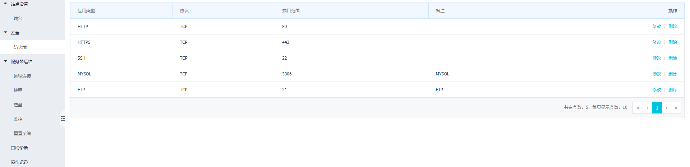

# SQL

## docker  mysql 配置 

```bash
docker run --name wukong-mysql -v "$PWD/data/wukong":/var/lib/mysql  -p 3306:3306  -e MYSQL_ROOT_PASSWORD=wukong   --restart=always -d mysql
```

## 查看端口是否开启
阿里云工作台
