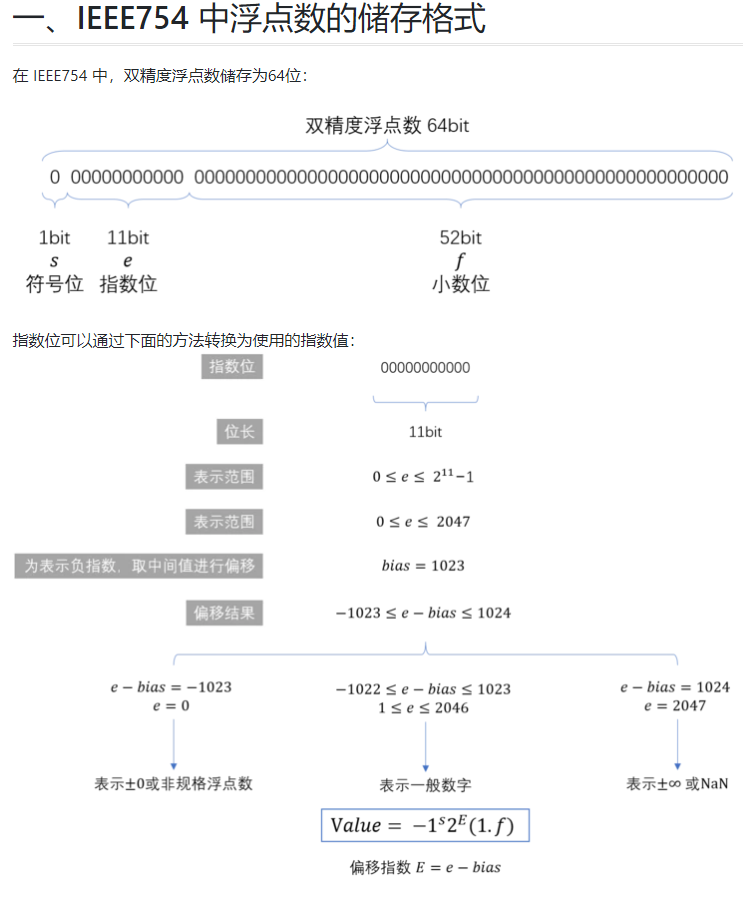
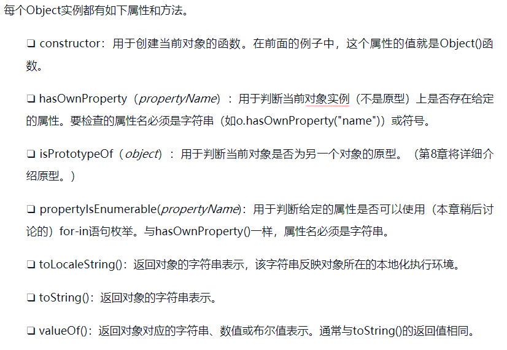

# FED note

## js高程

JS = ES+DOM+BOM

### html中的js

<code> \<script> </code> :可选属性

- async(立即开始下载，不能阻止其他页面操作)
- defer(脚本可以延迟到文档被完全解析和显示后执行)
- src 外部文件路径
- type  :module 会被解析为ES6模块
- scrossorigin : 配置相关请求的CORS（跨源资源共享）设置

包含在<code>\<script></code>内的代码会被从上到下解释 ,在<code>\<script></code>元素中的代码被计算完成之前，页面的其余内容不会被加载，也不会被显示。 **阻塞HTML解析**

<code>\script</code> 中的代码按照在页面中出现的顺序依次解释 ，（排除 <code>async|defer</code> 修饰）

现在实践将<code> \script</code> 标签放置在 body 标签之后 ，页面先渲染，然后处理 script 标签 ，用户会感觉加载的更快.
参考[浏览器](./optimize.md)

```js
<link res="proload" href="example.js" >
使预加载器识别
```

```js
<noscript>不支持js / 禁用js 的优雅降级  </noscript>
```

行内代码VS外部文件

- 可维护性
- 缓存
- 适应未来
- http2 支持

### 语言基础

- 语法
- 数据类型
var 函数作用域。声明的**变量**会被自动提升到函数作用域顶部 ，(赋值不会跟随提升) , 全局变量会成为window属性
let 块作用域。声明之前无法被引用，会抛出referrenceError .全局变量不会成为window 属性
const 块作用域，行为与let基本相同 ，声明变量必须初始化 。 基本类型，值不可修改，引用类型，内部属性可修改 ，指向不可修改。

简单数据类型：

- Undefined ：undefined 未定义

- Null :null 空指针对象 typeof null --> object  , 显示的初始化null
- Boolean : true / false

- Number : 双精度浮点型
[双精度浮点型](https://segmentfault.com/a/1190000008268668)


乘2法

```sh
  0.35×2=0.7 ······ 取0（d1）
  0.7×2=1.4 ······ 取1（d2）
  0.4×2=0.8 ······ 取0（d3）
  0.8×2=1.6 ······ 取1（d4）
  0.6×2=1.2 ······ 取1（d5）
  0.2×2=0.4 ······ 取0（d6）
  ·····
  直到满足规定的位数为止
  
  所以（0.35）10=（0.d1d2d3d4d5d6）2=（0.010110）2

  0.1 = "0.0001100110011001100110011001100110011001100110011001101"
  0.2 = "0.001100110011001100110011001100110011001100110011001101"

  Number.MIN_VALUE ,Number.MAX_VALUE

  NaN：Not a Number
    - 任何涉及NaN的操作始终返回NaN
    - NaN不等于包括NaN在内的任何值
    - isNaN()函数

```

- String:
ECMAScript中的字符串是不可变的（immutable），意思是一旦创建，它们的值就不能变了。要修改某个变量中的字符串值，必须先销毁原始的字符串，然后将包含新值的另一个字符串保存到该变量.
ECMAScript 6新增了使用模板字面量定义字符串的能力。与使用单引号或双引号不同，模板字面量保留换行字符，可以跨行定义字符串
```js
const value = 20;
const  str = `hello ,wolrd .
保留换行
使用差值：${value} , ${value.toString().slice(1)}
`
```
tag function ：标签函数 ,Tag functions don't even need to return a string!

```js
let person = 'Mike';
let age = 28;

function myTag(strings, personExp, ageExp) {
  let str0 = strings[0]; // "That "
  let str1 = strings[1]; // " is a "
  let str2 = strings[2]; // "."

  let ageStr;
  if (ageExp > 99){
    ageStr = 'centenarian';
  } else {
    ageStr = 'youngster';
  }

  // We can even return a string built using a template literal
  return `${str0}${personExp}${str1}${ageStr}${str2}`;
}

let output = myTag`That ${ person } is a ${ age }.`;

console.log(output);
// That Mike is a youngster.
```
因为表达式参数的数量是可变的，所以通常应该使用剩余操作符（rest operator）将它们收集到一个数组中.


```js
let a = 6 ,b=9;

function simpleTag(strings,...expressions){
  console.log(strings)
  for(const expression of expressions){
    console.log(expression)
  }

  return 'foobar'
}

// The special raw property, available on the first argument to the tag function, allows you to access the raw strings as they were entered, without processing escape sequences.

function tag(strings) {
  console.log(strings.raw[0]);
}

tag`string text line 1 \n string text line 2`;
// logs "string text line 1 \n string text line 2" ,

```

- Symbol:

ES6 新增的类型 ，用来做对象的key
如果运行时的不同部分需要共享和重用符号实例，那么可以用一个字符串作为键，在全局符号注册表中创建并重用符号
全局注册表中的符号必须使用字符串键来创建
即使采用相同的符号描述，在全局注册表中定义的符号跟使用Symbol()定义的符号也并不等同：
即使采用相同的符号描述，在全局注册表中定义的符号跟使用Symbol()定义的符号也并不等同：
```js
 /** Symbol([description])  */
let symbol  = Symbol('foo') ; // 局部注册
let globalSymbol  = Symbol.for('foo'); // 全局注册的  
console.log(Symbol.ketFor(symbol)); //  查找symbol 对应的键 foo 
```


复杂数据类型: 
- Object

因为在ECMAScript中Object是所有对象的基类，所以任何对象都有这些属性和方法



- 控制流

- 函数

### 变量 作用域 内存

### 基本引用类型

### 集合引用类型

### 迭代器与生成器

### 对象类面向对象编程

### 代理与反射

### 函数

### prosmise 与异步函数

### BOM

### 客户端检测

### DOM

### DOM扩展

### 事件

### 动画与canvas

### 表单脚本

### js API

### 错误处理与调试

### 处理XML

### JSON

### 网络请求与远程资源

### 客户端储存

### 模块

### worker

### 最佳实践
