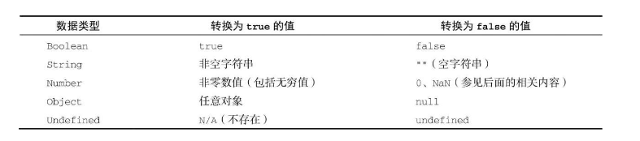
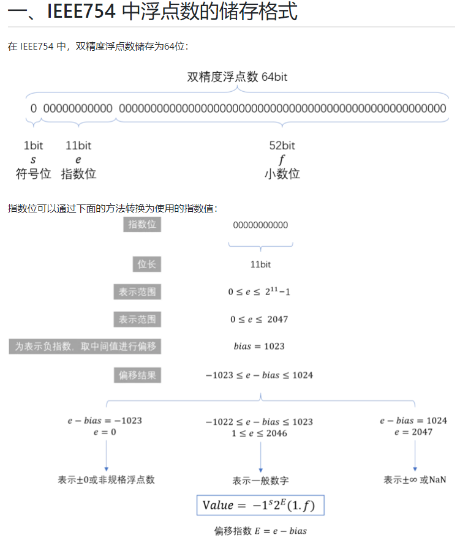
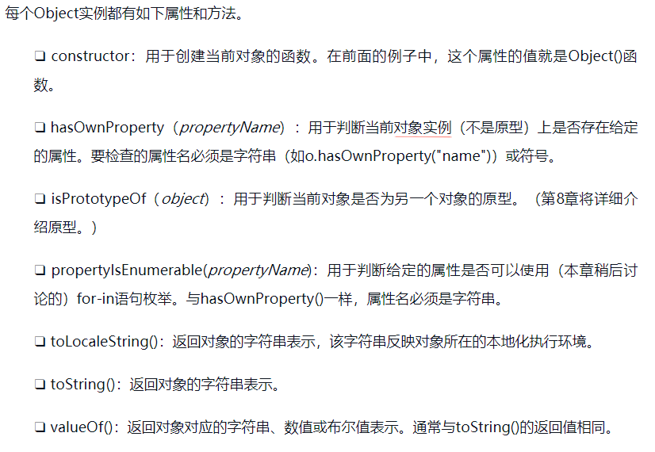
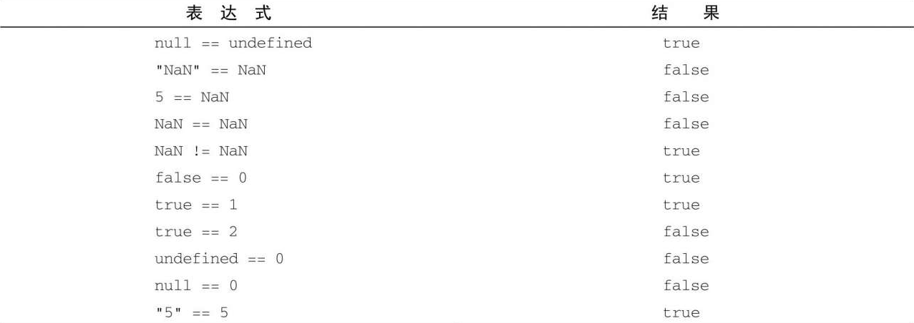
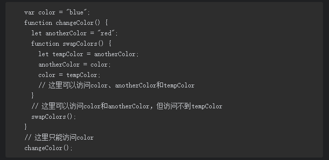
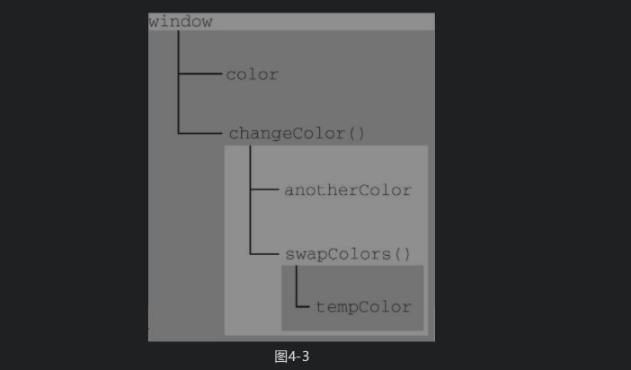

# js高级程序设计
## \<script>标签

<code> \<script> </code> :可选属性

- async:立即开始下载，不能阻止其他页面操作
- defer:脚本可以延迟到文档被完全解析和显示后执行
- src:外部文件路径- type:module 会被解析为ES6模块
- scrossorigin : 配置相关请求的CORS（跨源资源共享）设置

包含在<code>\<script></code>内的代码会被从上到下解释 ,在<code>\<script></code>元素中的代码被计算完成之前，页面的其余内容不会被加载，也不会被显示。 **阻塞HTML解析**

<code>\<script></code> 中的代码按照在页面中出现的顺序依次解释 ，（排除 <code>async|defer</code> 修饰）

现在实践将<code> \<script></code> 标签放置在 body 标签之后 ，页面先渲染，然后处理 script 标签 ，用户会感觉加载的更快.
参考[浏览器](./optimize.md)

### 动态加载脚本
通过向dom中动态添加script元素可以加载指定脚本（环境切换）
为了让预加载器识别动态请求的存在，在文档头部显示的进行申明
```js
<link res="preload" href="example.js" > //使预加载器识别

....

<script>
let script = document.createElement('script');
script.src = 'example.js';
script.async = false;// 兼容
document.head.appendChild(script);
</script>
```


```js
<noscript>不支持js / 禁用js 的优雅降级  </noscript>
```

行内代码VS外部文件

- 可维护性：所有js文件在一个目录中，更好维护
- 缓存: 外部链接的js文件会浏览器被缓存
- 适应未来：
- http2支持：H2对于小文件支持更佳，非H2使用大文件比较合适

### 小结
1. 要包含外部的js文件，src属性设置为需要包含的url，可以跨域。支持动态添加脚本
2. <code>\<script></code> 会按照在文档中出现的顺序被解释。除非遇到 <code>defer|async</code>
3. <code>\<script></code> 标签会阻塞HTML解析，通常放在页面底部 <code>\</body></code>标签之前
4. <code>defer</code> 推迟到文档渲染完成后执行，按顺序。<code>async</code> 不阻塞文档，不保证顺序

## 语言基础

### 语法
var 函数作用域。声明的**变量**会被自动提升到函数作用域顶部 ，(赋值不会跟随提升) , 全局变量会成为window属性
let 块作用域。声明之前无法被引用，会抛出referrenceError .全局变量不会成为window 属性
const 块作用域，行为与let基本相同 ，声明变量必须初始化 。 基本类型，值不可修改，引用类型，内部属性可修改 ，指向不可修改。

### 数据类型：
原始数据类型：Undefined,Null,Boolean,Number,String,Symbol

- Undefined ：undefined 未定义
- Null :null 空指针对象 typeof null --> object  , 显示的初始化null
- Boolean : true / false

- Number : 双精度浮点型
[双精度浮点型](https://segmentfault.com/a/1190000008268668)

  - 整数32bit，浮点数64bit，整数占用空间更小，小数点后没有数字的情况下，会被转换成整数。

  - 乘2法：浮点数计算方式
  ```sh
    0.35×2=0.7 ······ 取0（d1）
    0.7×2=1.4 ······ 取1（d2）
    0.4×2=0.8 ······ 取0（d3）
    0.8×2=1.6 ······ 取1（d4）
    0.6×2=1.2 ······ 取1（d5）
    0.2×2=0.4 ······ 取0（d6）
    ·····
    直到满足规定的位数为止
    
    所以（0.35）10=（0.d1d2d3d4d5d6）2=（0.010110）2

    0.1 = "0.0001100110011001100110011001100110011001100110011001101"
    0.2 = "0.001100110011001100110011001100110011001100110011001101"
    0.3 = "0.010011001100110011001100110011001100110011001100110011"

    所以 0.1 + 0.2 != 0.3 , 二进制无限循环 

  ```
  - NaN：Not a Number
      - 任何涉及NaN的操作始终返回NaN
      - NaN不等于包括NaN在内的任何值
      - isNaN()函数

  - Number()函数转换规则：
    - 布尔值：true 1 , false 0
    - 数值直接返回
    - null，返回0
    - undefined,返回NaN
    - 字符串：
      - 如果字符串包含数值字符，字符前带+，-的情况下，转换为十进制数值(忽略前面的零)
      - 包含浮点数，转换为浮点数，(忽略前面的零)
      - 十六进制格式"0xf", 转换为十进制
      - 空白字符串，返回0
      - 其他返回NaN
    - 对象：
      - 调用valueOf()方法，按上述转换。如结果是NaN，调用toStirng(),按照字符转换。
    > 一元操作符"+"和Number遵守相同的规则

- String:
  - ECMAScript中的字符串是不可变的（immutable），意思是一旦创建，它们的值就不能变了。要修改某个变量中的字符串值，必须先销毁原始的字符串，然后将包含新值的另一个字符串保存到该变量.
  - ECMAScript 6新增了使用模板字面量定义字符串的能力。与使用单引号或双引号不同，模板字面量保留换行字符，可以跨行定义字符串

  ```js
  const value = 20;
  const  str = `hello ,wolrd .
  保留换行
  使用差值：${value} , ${value.toString().slice(1)}
  `
  ```

tag function ：标签函数 ,Tag functions don't even need to return a string!

```js
let person = 'Mike';
let age = 28;

function myTag(strings, personExp, ageExp) {
  let str0 = strings[0]; // "That "
  let str1 = strings[1]; // " is a "
  let str2 = strings[2]; // "."

  let ageStr;
  if (ageExp > 99){
    ageStr = 'centenarian';
  } else {
    ageStr = 'youngster';
  }

  // We can even return a string built using a template literal
  return `${str0}${personExp}${str1}${ageStr}${str2}`;
}

let output = myTag`That ${ person } is a ${ age }.`;

console.log(output);
// That Mike is a youngster.
```

因为表达式参数的数量是可变的，所以通常应该使用剩余操作符（rest operator）将它们收集到一个数组中.

```js
let a = 6 ,b=9;

function simpleTag(strings,...expressions){
  console.log(strings)
  for(const expression of expressions){
    console.log(expression)
  }

  return 'foobar'
}

// The special raw property, available on the first argument to the tag function, allows you to access the raw strings as they were entered, without processing escape sequences.

function tag(strings) {
  console.log(strings.raw[0]);
}

tag`string text line 1 \n string text line 2`;
// logs "string text line 1 \n string text line 2" ,

```

- Symbol:

  - ES6 新增的类型，symbol是用来创建唯一记号，进而作为非字符串形式的对象属性。
  - 如果运行时的不同部分需要共享和重用符号实例，那么可以用一个字符串作为键，在全局符号注册表中创建并重用符号
  全局注册表中的符号必须使用字符串键来创建
  - 即使采用相同的符号描述，在全局注册表中定义的符号跟使用Symbol()定义的符号也并不等同：

  ```js
  /** Symbol([description])  */
  let symbol  = Symbol('foo') ; // 局部注册
  let globalSymbol  = Symbol.for('foo'); // 全局注册的  
  console.log(Symbol.ketFor(symbol)); //  查找symbol 对应的键 foo 

  Reflect.ownkeys() 返回常规类型+Symbol类型的键，deepClone中使用

  instanceof 会调用 Symbol.hasInstance 函数确定原型关系

  class Bar {}
  class Baz extends Bar {
    static[Symbol.hasInstance](){
      return false;  // instanceof 调用
    }
  }

  let b = new Baz();
  b instanceof Bar ; // true
  b instanceof Baz ; // false, 被覆写

  ```

复杂数据类型:

- Object

因为在ECMAScript中Object是所有对象的基类，所以任何对象都有这些属性和方法


### 操作符

- 位操作：ECMAScript中的所有数值都以IEEE 754 64位格式存储，但位操作并不直接应用到64位表示，而是先把值转换为32位整数，再进行位操作，之后再把结果转换为64位。  *即位操作只需要考虑32位整数即可*
- 有符号整数  前31位代表数值，第32位代表符号 ，0正 1负
负值使用补码存储 ： 1 计算绝对值的二进制，2 翻转所有位（即补码） 3  加1

- 按位非: ~
作用：返回一个数的补数，最终效果是对数值取反并减1
- 按位与: &
本质是将两个数的每一位对齐 ， 全1 为1
- 按位或:|
有1 为1
- 按位异或:^
不相同返回1
- 左移 :<<
相当于 *2 的n次方，保留符号
- 右移: >>
有符号右移 ，符号位会填入空位
无符号右移， 空位补0

- 相等操作符
- 等于和不等于  == != , 比较之前会进行类型转换

1. 数值vs 非数值 ，尝试转换为数值
2. 字符串vs 非字符串 ,尝试转换为字符串
3. 对象vs 非对象 ，调用valueOf() ，然后按1 2 比较

特殊规则：

1. null == undefined
2. null undefined  不发生类型转换
3. NaA != 任意值 ，返回true ，  包括 NaN != NaN  // true
4. 比较对象，判断是不是同一对象 ，（引用相同）
 

- 全等和不全等 ===  !== ， 不会进行类型转换
比较时不转换操作数

- 控制流

```js
/** for in  遍历非 symbol属性  适用对象*/
for(const prop in object){
  console.log(prop)
}

/** for of 遍历可迭代对象 , 使用数组 */
for (const prop of expression ) {
  console.log(prop)
}

/** 标签语句 ，可以配合break continue 使用  */
outer_block:
for(let i=0;i<10;i++){
  inner_block:
  for(let j=0;j<10;j++){
     if(j==5){
       //  跳出标签为 outer_block 的循环
       break outer_block;
     }
     console.log('i,j',i,j);
  }
}

/** js switch 的value 可以是任意数据类型，使用=== 进行比较，不会进行类型转换 */
switch (value){
  case value1:
    statement
    break;
  case value2:
    statement;
    break;
  default:
    statement;
}

```

- 函数：要么返回值，要么不返回值，特定条件返回值在调试时会带来麻烦

## 变量 作用域 内存

ES 的变量分为原始值和引用值 ： 原始值是最简单的数据（按值访问）（Undefined、Null、Boolean、Number、String和Symbol），引用值是多个值构成的对象（引用访问）

- 对于引用值而言，可以随时添加、修改和删除其属性和方法

- 原始类型的初始化可以只使用原始字面量形式。如果使用的是new关键字，则JavaScript会创建一个Object类型的实例，但其行为类似原始值

- 复制问题：
  通过一个变量赋值到另一个变量时，原始值会被复制到新变量问位置， 两个变量独立使用 ，互不干扰
  引用值的赋值，储存在变量中值也会被复制到新变量所在的位置，但赋值的值其实是**指针**。

- 参数传递
  ECMAScript中所有函数的参数都是按值传递的。这意味着函数外的值会被复制到函数内部的参数中，就像从一个变量复制到另一个变量一样。
  如果是原始值，那么就跟原始值变量的复制一样。如果是引用值，那么就跟引用值变量的复制一样
  ```js
  function setName(obj){
    obj.name = 'foo';
    obj = new Object();
    obj.name = 'bar';
  }
  let person = new Object();
  setName(person);
  console.log(person.name); //  "foo" ， obj 按值传递。 'bar'被销毁，不会影响传入的obj
  ```

### 作用域
#### 作用域
- 作用域是：当前执行的上下文，值和表达式在其中可见或可被访问。
- 作用域链：当在js中使用一个变量的时候，首先js会尝试在当前作用域下寻找该变量，如果没有找到，再到它的上层去寻找，逐级寻找直到找到变量（没找到通常会报错）

- 作用域增强：try...catch | with 会添加临时的作用域，代码执行完毕后会删除



### GC: 垃圾回收

#### 标记清理

垃圾回收程序运行的时候，会标记内存中存储的所有变量（记住，标记方法有很多种）。然后，它会将所有在上下文中的变量，以及被在上下文中的变量引用的变量的标记去掉。在此之后再被加上标记的变量就是待删除的了，原因是任何在上下文中的变量都访问不到它们了
**一般使用可达性分析** ，从根节点开始，找到所有从根开始引用的对象。从根开始，gc将找到所有可以获得的对象和收集所有不可获得的对象

#### 引用计数

其思路是对每个值都记录它被引用的次数。声明变量并给它赋一个引用值时，这个值的引用数为1。如果同一个值又被赋给另一个变量，那么引用数加1
**循环引用的问题：不常用**

#### 内存管理
只保存必要的数据，非不要数据置为null，解除引用。解除引用之后，相关的值不在上下文中，因此下次gc会被回收。

- const，let 提升性能，块级作用域可以更早的触发gc程序介入
- 共享隐藏类，避免动态添加和删除属性，构造时一次声明，不要的属性置为null
- 防止内存泄露，挂载window上下文的对象，不手动清理 会一直存在 ，闭包很容易导致内存泄露
- 静态分配和对象池，不要频繁的创建和销毁对象，减少gc的频率。

### 基本引用类型

### 集合引用类型

### 迭代器与生成器

### 对象类面向对象编程

### 代理与反射

### 函数

### prosmise 与异步函数

### BOM

### 客户端检测

### DOM

### DOM扩展

### 事件

### 动画与canvas

### 表单脚本

### js API

### 错误处理与调试

### 处理XML

### JSON

### 网络请求与远程资源

### 客户端储存

### 模块

### worker

### 最佳实践
