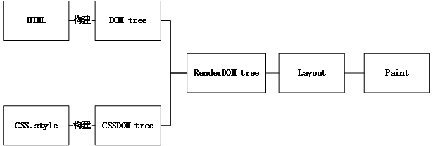

# 优化相关

## 浏览器工作原理

参考资料：
<https://developer.mozilla.org/zh-CN/docs/Web/Performance/How_browsers_work>
<https://developer.mozilla.org/en-US/docs/Web/Performance/Critical_rendering_path>

### 解析

1. 构建DOM Tree
    浏览器解析并构建dom tree 。
    >According to the Document Object Model (DOM), every HTML tag is an object. Nested tags are “children” of the enclosing one. The text inside a tag is an object as well.

    DOM树描述了文档的内容。<code>html</code>元素是第一个标签也是文档树的根节点。树反映了不同标记之间的关系和层次结构。嵌套在其他标记中的标记是子节点。DOM节点的数量越多，构建DOM树所需的时间就越长。

    <code>\<script></code>标签(不带有 async  defer属性) 会阻塞HTML的解析,占用线程 。
    **解析时等待获取css 图片 font 等不会阻塞HTML解析**

2. 构建CSSDOM Tree
    DOM和CSSOM是两棵树. 它们是独立的数据结构。
    浏览器将CSS规则转换为可以理解和使用的样式映射。浏览器遍历CSS中的每个规则集，根据CSS选择器创建具有父、子和兄弟关系的节点树。
    浏览器从适用于节点的最通用规则开始，并通过应用更具体的规则递归地优化计算的样式。

### 渲染  

**步骤包括样式、布局、绘制，在某些情况下还包括合成**

3. Style
    DOM tree 和 CSSDOM tree 进行结合 ==》 Render tree.
    DOM树的根开始构建，遍历每个可见节点。 在 render tree 中，所有DOM都应用了对应的CSSDOM
4. Layout

    第一次确定节点的大小和位置称为布局。随后对节点大小和位置的重新计算称为回流。
    第四步是在渲染树上运行布局以计算每个节点的几何体。布局是确定呈现树中所有节点的宽度、高度和位置，以及确定页面上每个对象的大小和位置的过程。
    回流是对页面的任何部分或整个文档的任何后续大小和位置的确定。
    为了确定每个对象的确切大小和位置，浏览器从Render DOM的根开始遍历它。
5. Paint
    最后一步是将各个节点绘制到屏幕上，。在绘制或光栅化阶段，浏览器将在布局阶段计算的每个框转换为屏幕上的实际像素。
    绘画包括将元素的每个可视部分绘制到屏幕上，包括文本、颜色、边框、阴影和替换的元素（如按钮和图像）.

    绘制可以将布局树中的元素分解为多个层。将内容提升到GPU上的层（而不是CPU上的主线程）可以提高绘制和重新绘制性能。
    当文档的各个部分以不同的层绘制，相互重叠时，必须进行合成，以确保它们以正确的顺序绘制到屏幕上，并正确显示内容。

    为了确保重绘的速度比初始绘制的速度更快，屏幕上的绘图通常被分解成数层。如果发生这种情况，则需要进行合成。

    **为了减小布局事件的频率和时长，批量更新或者避免改动盒模型属性**
;

优化方向:

- 减少阻塞 :
    js 会阻塞主线程解析HTML ，不重要的js放到后面加载或异步加载。
    获取css不阻塞html 解析，但是会阻塞js ，因为js会查询css信息。

- 减少重排
    Layout阶段， 确定节点的大小和位置。 大小 ，位置，dom 元素变动 增加 删除 都会造成Layout变化，reLayout + rePaint。
    缓存dom ，修改完成后 ，在进行替换

- 减少重绘
    Paint 阶段，绘制到屏幕上 ，bg ，text 等改变都引起，浏览器做过最小rePaint 优化。
    可以合并DOM 操作 ，改style -->改class

- 节流： scroll 等事件
