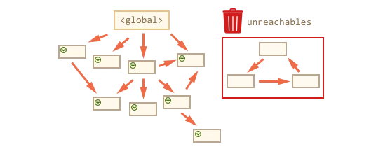

# TypeScript

---

## Function

> call()方法的作用和 apply() 方法类似，**区别** 就是call()方法接受的是参数列表，而apply()方法接受的是一个参数数组。

+ apply  
在一个对象的上下文中应用另一个对象的方法；参数能够以数组形式传入。

+ call
在一个对象的上下文中应用另一个对象的方法；参数能够以列表形式传入。

```js
func.apply(thisArg, [argsArray])
function.call(thisArg, arg1, arg2, ...)


let numbers = [5, 6, 7, 8, 9]

let max = Math.max.apply(null, numbers);
let array = ['a', 'b'];
//  apply 接收参数数组， []
numbers.push.apply(numbers, array);
// call 接收参数列表
numbers.push.call(numbers, ...array);

```

+ bind
bind() 方法创建一个新的函数，在 bind() 被调用时，这个新函数的 this 被指定为 bind() 的第一个参数，而其余参数将作为新函数的参数，供调用时使用。

+ 对象池

```js
objectPoolFactory: function (createFn) {
      let objects = [];
      // 利用闭包
      return {
        create: function () {
           let obj = objects.length? objects.shift(): createFn.apply(this,arguments);
           return obj;
        },
        recover: function (obj) {
            objects.push(obj);
        },
      };
    }
```

<!-- # MDN

## 基础

+ 变量声明
**var**  声明一个变量(局部变量|全局变量) , 可选初始化
**let**  块作用域的局部变量 , 可选初始化
**const** 块作用域的只读常量 , 必须初始化

+ 变量的作用域:
在函数之外声明的变量，叫做全局变量，因为它可被当前文档中的任何其他代码所访问。在函数内部声明的变量，叫做局部变量，因为它只能在当前函数的内部访问。

**语句块**中声明的**变量**将成为**语句块所在函数**（或全局作用域）的局部变量. --块作用域

变量提升&&函数提升:
var 声明的变量会被提升到代码块的顶部, 可以在声明之前被访问,在赋值之前 ,其值都是undefined .
let(const) 声明的变量同意会变量提升到顶部 , 不可以在声明之前被访问 , 在声明之前,不会被赋值.
ps: 对象属性被赋值为常量是不收保护的 ,  const A = {'key':'value'}  ,A.key = 'foo'
数组被定义为常量 , 也不受保护 . const ARR = [] , ARR.push('FOO')  // ['FOO']

函数: function foo(){} , 可以提升到代码块顶部
函数表达式: let foo = function(){} // let foo = function bar(){}, 没有提升

+ 数据类型:基本数据类型 + 对象
  + Boolean  , true , false
  + null , 关键字
  + undefined , 变量未赋值的属性
  + Number , 整数|浮点数
    + 八进制的整数以 0（或0O、0o）开头，只能包括数字0-7。
    + 十六进制整数以0x（或0X）开头，可以包含数字（0-9）和字母 a~f 或 A~F。
    + 二进制整数以0b（或0B）开头，只能包含数字0和1。
  + BigInt , 操作和储存大数
  + String , 字符序列
  + Symbol , 实例唯一 , 不可改变

+ 流程控制&&错误处理
以下会被计算为false
  + false
  + undefined
  + null
  + 0
  + NaN
  + 空字符串（""）

**ps**: new Boolean(false)  不在false 里面列表里面  

```js
let a = new Boolean(false);
if(a){  // a假值 , 视为真 
    console.log(a==true); // a 非true , 结果为假;
}
```

+ promise  TODO:
  + pending：初始的状态，即正在执行，不处于 fulfilled 或 rejected 状态。
  + fulfilled：成功的完成了操作。
  + rejected：失败，没有完成操作。
  + settled：Promise 处于 fulfilled 或 rejected 二者中的任意一个状态, 不会是 pending -->

## [垃圾回收GC](https://developer.mozilla.org/zh-CN/docs/Web/JavaScript/Memory_Management)

当内存不再需要使用时释放
引用：一个对象如果有访问另一个对象的权限（隐式或者显式），叫做一个对象引用另一个对象.
包含显示引用（属性）和隐式引用（原型）

### 引用计数GC

>这是最初级的垃圾收集算法。此算法把“对象是否不再需要”简化定义为“对象有没有其他对象引用到它”。如果没有引用指向该对象（零引用），对象将被垃圾回收机制回收。

缺点：无法解决循环引用  a-->b -->a

### 标记-清除 (现代浏览器使用)

>这个算法把“对象是否不再需要”简化定义为“对象是否可以获得”。
这个算法假定设置一个叫做根（root）的对象（在Javascript里，根是全局对象）。垃圾回收器将定期从根开始，找所有从根开始引用的对象，然后找这些对象引用的对象……从根开始，垃圾回收器将找到所有可以获得的对象和收集所有不能获得的对象。



<!-- 在JavaScript中，数据类型分为两类，简单类型和引用类型，对于简单类型，内存是保存在栈（stack）空间中，复杂数据类型，内存是保存在堆（heap）空间中。

基本类型：这些类型在内存中分别占有固定大小的空间，他们的值保存在栈空间，我们通过按值来访问的
引用类型：引用类型，值大小不固定，栈内存中存放地址指向堆内存中的对象。是按引用访问的。
而对于栈的内存空间，只保存简单数据类型的内存，由操作系统自动分配和自动释放。而堆空间中的内存，由于大小不固定，系统无法无法进行自动释放，这个时候就需要JS引擎来手动的释放这些内存。 -->

### chrome 对gc 的优化
<https://zhuanlan.zhihu.com/p/259579683>
