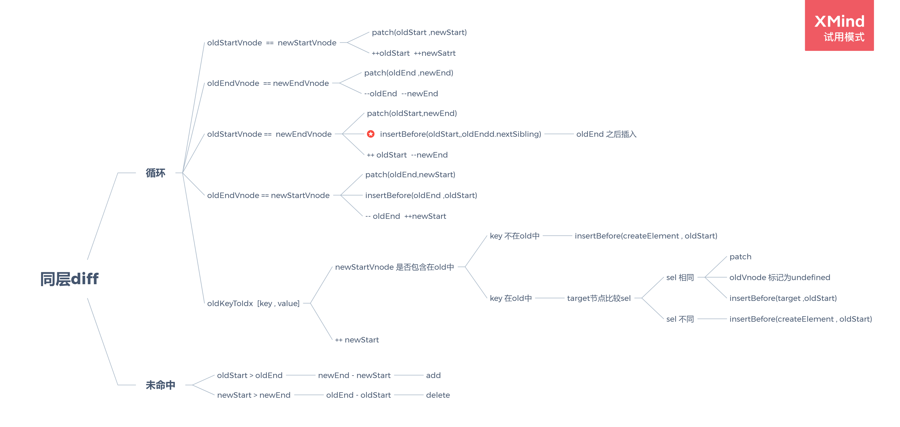

# vue2

## mvvm

<https://cn.vuejs.org/v2/guide/reactivity.html>

>当你把一个普通的 JavaScript 对象传入 Vue 实例作为 data 选项，Vue 将遍历此对象所有的 property，并使用 **Object.defineProperty** 把这些 >property 全部转为 getter/setter。Object.defineProperty 是 ES5 中一个无法 shim 的特性，这也就是 Vue 不支持 IE8 以及更低版本浏览器的原因。
> 这些 getter/setter 对用户来说是不可见的，但是在内部它们让 Vue 能够追踪依赖，在 property 被访问和修改时通知变更。这里需要注意的是不同浏览器在控制台打印数据对象时对 getter/setter 的格式化并不同，所以建议安装 vue-devtools 来获取对检查数据更加友好的用户界面。
>每个组件实例都对应一个 watcher 实例，它会在组件渲染的过程中把“接触”过的数据 property 记录为依赖。之后当依赖项的 setter 触发时，会通知 watcher，从而使它关联的组件重新渲染。


<<< @/docs/fed/Observer/index.js

<<< @/docs/fed/Observer/array.js

```js
// obj 属性嵌套的解决方案      a.b.name

```

## vite+vue3 项目搭建

----
参考:<https://vitejs.dev/guide/#scaffolding-your-first-vite-project>
<https://vuepress.vuejs.org/zh/theme/default-theme-config.html#%E9%A6%96%E9%A1%B5>
<https://vitejs.dev/guide>
<https://v3.vuejs.org/>

```sh
yarn create @vitejs/app FED-APP --template vue
cd FED-APP
yarn
yarn dev
```

### 配置路由

```sh
# 安装依赖
yarn add vue-router@4

# 创建router/index.js
import { createRouter, createWebHashHistory } from 'vue-router'
const routes = [
    {
        path:'/',
        name:'home',
        component:()=>import('@/components/HelloWorld.vue')
    }
]
const router = createRouter({
    history:createWebHashHistory(import.meta.env.BASE_URL),
    routes:routes
})
export default router
# 挂载到main.js 上面
import router from '/router/index'
use(router)
```

### 问题1：无法识别@

```js
在vite.config.js 中配置  resolve
import { defineConfig } from 'vite'
import vue from '@vitejs/plugin-vue'
const {resolve} = require('path')
// https://vitejs.dev/config/
export default defineConfig({
  plugins: [vue()],
  resolve:{
    alias:[
      {find:'@',replacement:resolve(__dirname,'src')}
    ]
  }
})

```

## webpack  配置

### 概念

- entry   构建依赖的起点
- output  打包后的输出配置
- loader  解析资源文件
- plugin  插件使用
- mode    模式

webpack.config.js

```js
const {resolve} = require('path');
const HtmlWebpackPlugin = require('html-webpack-plugin'); // 自动生成index.html
const BundleAnalyzerPlugin = require('webpack-bundle-analyzer').BundleAnalyzerPlugin;  /// boundle 分析工具
const CompressionPlugin = require("compression-webpack-plugin");  // 压缩文件 .gz

module.exports ={
    // entry:'./src/index.js',
    entry:{
        index:'./src/index.js',  // 多入口
        print:'./src/print.js'   // 多入口
    },
    devServer:{
        contentBase:'./dist',  // server 输出目录
        publicPath:'/',
        hot:true, // 开启模块热替换   -- vite 的dev采用 ESM 可以做到按需加载 ， 更有优势。但是打包还是一样。
        compress:true, // 启用压缩
    },
    plugins:[
        new HtmlWebpackPlugin({
            title:"管理输出", // 配置自动生成 index.html
        }),
        new BundleAnalyzerPlugin(), // boundle 分析工具
        new CompressionPlugin({
            test:/\.js(\?.*)?$/i
        }), // 压缩为.gz 文件
    ],
    output:{
        // filename:'[name].boundle.js',
        filename:'[name].[contenthash].js', // 使用hash缓存
        path:resolve(__dirname,'dist'),
        clean:true,  // 打包后清理dist,
        // https://webpack.docschina.org/guides/author-libraries/  打包类库配置
        // library:{
        //     name:'customLib',
        //     type:'umd',
        // }
    },
    // 代码分离
    optimization:{
        moduleIds: 'deterministic', // 保持vendor 不变
        runtimeChunk:true, // 创建额外的chunk
        // 分离重复引用
        splitChunks:{
            cacheGroups:{
                vendor:{
                    test: /[\\/]node_modules[\\/]/,
                    name: 'vendors',
                    chunks: 'all',
                }
            },
            chunks:'all',
        }
    },
    mode:'production',
    module:{
        rules:[
            // 使用正则表达式来匹配对应的loader , 链式传递
            {
                test: /\.css$/i,
                use: ['style-loader', 'css-loader'],
            },
        ]
    }
    // https://webpack.docschina.org/guides/scaffolding/
}
```

或者为开发环境 ， 生产环境单独进行配置

```js
// webpack.common.js
const path = require('path');
const HtmlWebpackPlugin = require('html-webpack-plugin');
const WorkboxPlugin = require('workbox-webpack-plugin');

module.exports = {
  entry: {
    app: './src/index.js',
  },
  plugins: [
    new HtmlWebpackPlugin({
      title: 'Production',
    }),
    new WorkboxPlugin.GenerateSW({
      clientsClaim:true,
      skipWaiting:true,
    })
  ],
  output: {
    filename: '[name].bundle.js',
    path: path.resolve(__dirname, 'dist'),
    clean: true,
  },
  module:{
    rules:[
        // 使用正则表达式来匹配对应的loader , 链式传递
        {
            test: /\.css$/i,
            use: ['style-loader', 'css-loader'],
        },
    ]
}
};

// webpack.dev.js
const {merge} = require('webpack-merge');
const common = require('./webpack.common');
 module.exports = merge(common,{
     mode:'development',
     devtool:'inline-source-map',
     devServer:{
         contentBase:'./dist',
         port:3000,
         hot:true,
         compress:true,
     }
 })

// webpack.prod.js

// https://webpack.docschina.org/guides/production/
const {merge} = require('webpack-merge');  // 合并配置文件
const common = require('./webpack.common');
const BundleAnalyzerPlugin = require('webpack-bundle-analyzer').BundleAnalyzerPlugin;  /// boundle 分析工具
const {resolve} = require('path');
const CompressionPlugin = require("compression-webpack-plugin");  // 压缩文件 .gz


module.exports = merge(common,{
    mode:'production',
    plugins:[
        new BundleAnalyzerPlugin(),
        new CompressionPlugin({
            test:/\.js(\?.*)?$/i
        }), // 压缩为.gz 文件
    ],
    devtool:'source-map', // 生产环境启用 source-map
    output:{
        // filename:'[name].boundle.js',
        filename:'[name].[contenthash].js', // 使用hash缓存
        path:resolve(__dirname,'dist'),
        clean:true,  // 打包后清理dist,
        // https://webpack.docschina.org/guides/author-libraries/  打包类库配置
        // library:{
        //     name:'customLib',
        //     type:'umd',
        // }
    },
    // 代码分离
    optimization:{
        moduleIds: 'deterministic', // 保持vendor 不变
        runtimeChunk:true, // 创建额外的chunk
        // 分离重复引用
        splitChunks:{
            cacheGroups:{
                vendor:{
                    test: /[\\/]node_modules[\\/]/,
                    name: 'vendors',
                    chunks: 'all',
                }
            },
            chunks:'all',
        }
    },
})
```

## [nabbdom](https://github.com/snabbdom/snabbdom)

### vnode

Properties

- sel:String  The .sel property of a virtual node is the CSS selector passed to h() during creation.   *css选择器*
- data:OBject The .data property of a virtual node is the place to add information for modules to access and manipulate the real DOM element when it is created; Add styles, CSS classes, attributes, etc.  *dom属性*
- children：Array during creation. .children is simply an Array of virtual nodes that should be added as children of the parent DOM node upon creation.  *虚拟节点的子节点数组*
- text：String The .text property is created when a virtual node is created with only a single child that possesses text and only requires document.createTextNode() to be used. *只有一个使用createTextNode创建的子节点*
- elm ：Element  The .elm property of a virtual node is a pointer to the real DOM node created by snabbdom. This property is very useful to do calculations in hooks as well as modules.
- key:String|Number The .key property is used to keep pointers to DOM nodes that existed previously to avoid recreating them if it is unnecessary. This is very useful for things like list reordering.  *diff时使用key作比较*

```js
export function vnode(sel, data, children, text, elm) {
    let key = data == undefined ? undefined : data.key;
    return { sel, data, children, text, elm, key };
}


/**
 * h函数 ，创建出虚拟节点
 * @param {String} a selector 
 * @param {Object} b data 
 * @param {Array|String} c children  // 子元素 
 */
export function h(a, b, c) {
    // 第一种情况 ，最简易的  h('div',{key:'key'},'hello')
    if (typeof c == 'string') {
        return vnode(a, b, undefined, c, undefined);
    }
    // 第二种情况 ，c是数组 ，数组里面包含 h('ul',{key:'key'},[h('li',{key:1},'1')]);
    if (Array.isArray(c)) {
        let children = [...c];
        return vnode(a, b, children, undefined, undefined);
    }
    // 第三种情况 ,  h('div',{key:"key"},h('div',{key:2},"inner"))  // c是vnode对象 具有sel 属性
    if (c.sel) {
        let children = [];
        children.push(c);
        return vnode(a, b, children, undefined, undefined);
    }
}
```

### patch

比较策略：

- 节点相同，同层diff
- 节点不同 ，先添加新节点 ，然后删除老节点 *diff*

> vnode sel 和 key相同 认为节点相同

### diff

简易版:vnode+diff <https://github.com/xinglong-zh/demo/tree/v0.1/webpack/src/snabbdom>


----

定义四个指针：

旧节点 ： 头指针 ，尾指针
新节点 ： 头指针 ，尾指针

循环比较： (头指针<= 尾指针)

旧头指针 == 新头指针 ： 头指针下移
旧尾指针 == 新未指针 ： 尾指针上移
旧头指针 == 新尾指针 ： 旧头指针插入旧尾指针之后 ， 头指针下移 ，尾指针上移
旧尾指针 == 新头指针 ： 旧尾指针稠入旧头指针之前 ， 头指针下移 ，尾指针上移

上述情况均未命中 ：

- 旧节点不包含 新头指针 ： 创建节点 ，插入旧头指针之前
- 旧节点包含 新头指针 ：
  - 选择器不同 ， 创建节点，插入旧头指针之前
  - 选择器相同 ， 原旧节点标记为undefined  ，新头指针插入到旧头指针之前*

循环结束：
旧节点先结束： 剩余新节点插入到尾部
新节点先结束:  剩余旧节点删除

```js
/**
 * 简易版本patch node函数
 */
export function patchVnode(oldVnode, vnode) {
    let oldCh = oldVnode.children;
    let newCh = vnode.children;
    // 创建四个指针
    let oldStartIdx = 0;
    let oldEndIdx = oldCh?.length - 1;
    let newStartIdx = 0;
    let newEndIdx = newCh?.length - 1;
    // 创建四个指针
    let oldStartVnode = oldCh[oldStartIdx];
    let oldEndVnode = oldCh[oldEndIdx];
    let newStartVnode = newCh[newStartIdx];
    let newEndVnode = newCh[newEndIdx];
    let oldKeyToIdx;
    let elmToMove;
    let idxInOld;  //vnode index in oldch

    while (oldStartIdx <= oldEndIdx && newStartIdx <= newEndIdx) {
        // 开始diff算法
        if (sameVnode(oldStartVnode, newStartVnode)) {
            // patchVnode(oldStartVnode, newStartVnode); // patch children 不存在的情况
            oldStartVnode = oldCh[++oldStartIdx];
            newStartVnode = newCh[++newStartIdx];
        } else if (sameVnode(oldEndVnode, newEndVnode)) {
            // patchVnode(oldEndVnode,newEndVnode)
            oldEndVnode = oldCh[--oldEndIdx];
            newEndVnode = newCh[--newEndIdx];
        } else if (sameVnode(oldStartVnode, newEndVnode)) {
            // patchVnode(oldStartVnode, newEndVnode);
            // 插入到 oldend 之后
            insertBefore(oldVnode.elm, oldStartVnode.elm, nextSibling(oldEndVnode.elm));
            oldStartVnode = oldCh[++oldStartIdx];
            newEndVnode = newCh[--newEndIdx];
        } else if (sameVnode(oldEndVnode, newStartVnode)) {
            // patchVnode(oldEndVnode, newStartVnode);
            insertBefore(oldVnode.elm, oldEndVnode.elm, oldStartVnode.elm);
            oldEndVnode = oldCh[--oldEndIdx];
            newStartVnode = newCh[++newStartIdx];
        } else {
            // 未找到的情况下
            if (oldKeyToIdx == undefined) {
                oldKeyToIdx = createKeyToOldIdx(oldCh, oldStartIdx, oldEndIdx);
            }
            idxInOld = oldCh[newStartVnode.key];
            if (isUndef(idxInOld)) {

                // 创建
                createElement(newStartVnode);

                insertBefore(oldVnode.elm, newStartVnode.elm, oldStartVnode.elm);
            } else {
                // key 在index中存在
                elmToMove = oldCh[idxInOld];

                if (elmToMove.sel !== newStartVnode.sel) {
                    // 选择器不同
                    insertBefore(oldVnode.elm, createElement(newStartVnode), oldStartVnode);
                } else {
                    // 选择器相同 ，原来的标记为undefined 
                    // patchVnode(elmToMove,newStartVnode);
                    oldCh[idxInOld] = undefined;
                    insertBefore(oldVnode.elm, elmToMove.elm, oldStartVnode.elm);
                }

            }
            newStartVnode = newCh[++newStartIdx];
        }

    }

    if (oldStartIdx > oldEndIdx || newStartIdx > newEndIdx) {
        // 两个长度不一致
        if (oldStartIdx > oldEndIdx) {
            // 添加  newEndIdx - newStartIdx 之间的元素
            addNodes(oldVnode.elm, newCh, newStartIdx, newEndIdx);
        } else {
            // 删除  oldEndIdx - oldStartIdx 之间的元素
            removeNodes(oldVnode.elm, oldCh, oldStartIdx, oldEndIdx);
        }
    }
}
```
