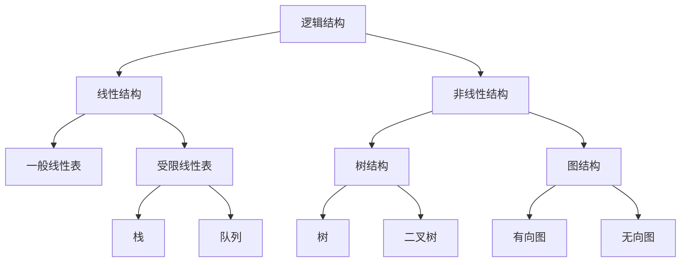
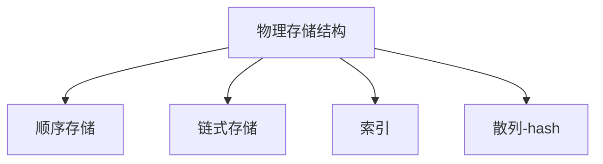

# 数据结构

-------------

## 数据结构概念

抽象数据类型：abstract data type

数据：可观事物的符号表示
数据类型：数据值的集合 + 集合上的操作

抽象：

+ 与存放的机器无关
+ 与数据存储的物理结构无关
+ 与实现的操作的算法和实现的语言无关

**数据结构 = 逻辑结构(线性表，树， 图) + 物理储存结构（数组 ，链表）+ 操作(算法)**.

算法：Algorithm 为了解决某类问题而规定的一个有限长的操作序列
算法的五个特征：

1. 有穷性   执行有穷步后，在有穷的时间内得到结果
2. 确定性   每种情况下所执行的操作，在算法中有明确的规定，不会产生二义性
3. 可行性    算法中的所有操作都可以通过已经实现的基本操作运算执行有限次来实现
4. 输入   有0个或多个输入
5. 输出   有一个或多个输出

算法分析：

1. 时间复杂度： O渐进上界   0 < T(n) < O(n)   Ω渐进下界  θ渐进确界
2. 空间复杂度：   .

## 线性表  

线性结构的基本特点是除第一个元素无直接前驱，最后一个元素无直接后继之外，其他每个数据元素都有一个前驱和后继。

线性表的操作：

1. 创建一个空的线性表
2. 返回线性表是否为满
3. 返回第K个位置的元素
4. 插入一个元素
5. 删除一个元素

## 树

## 图
