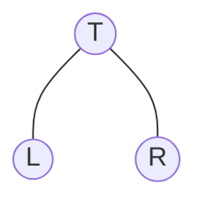

# 数据结构

-------------

## 数据结构概念

抽象数据类型：abstract data type

数据：可观事物的符号表示
数据类型：数据值的集合 + 集合上的操作

抽象：

+ 与存放的机器无关
+ 与数据存储的物理结构无关
+ 与实现的操作的算法和实现的语言无关

**数据结构 = 逻辑结构(线性表，树， 图) + 物理储存结构（数组 ，链表）+ 操作(算法)**.


算法：Algorithm 为了解决某类问题而规定的一个有限长的操作序列
算法的五个特征：

1. 有穷性   执行有穷步后，在有穷的时间内得到结果
2. 确定性   每种情况下所执行的操作，在算法中有明确的规定，不会产生二义性
3. 可行性    算法中的所有操作都可以通过已经实现的基本操作运算执行有限次来实现
4. 输入   有0个或多个输入
5. 输出   有一个或多个输出

算法分析：

1. 时间复杂度： O渐进上界   0 < T(n) < O(n)   Ω渐进下界  θ渐进确界
2. 空间复杂度：   .

## 线性表  

线性结构的基本特点是除第一个元素无直接前驱，最后一个元素无直接后继之外，其他每个数据元素都有一个前驱和后继。

线性表的操作：

1. InitList(L) 初始化一个空的线性表
2. locateElem(L,e) 按值查找 ，返回e在线性表中的位置
3. getElem(L,K)  按位查找 ，返回index=k位置上的元素
4. Insert(L,i,e) 在指定位置i上插入一个元素
5. delete(L,i)  删除指定位置上的元素
6. Length(L)  返回线性表的长度

线性表的两种实现：

+ 数组实现：
按位查找速度快，直接计算地址
插入到i位置， i后面的元素需要向后移动，操作慢。删除同理

+ 链表实现
按位查找需要指针移动i次，速度慢
插入，删除，找到对应位置的前一项，改变指针指向，操作快。查找耗时。

### 栈

栈是一种操作受限的线性表。只能在栈顶进行操作。

栈的操作：
入栈  把一个元素放在栈顶
出栈  从栈顶弹出一个元素

栈的实现
数组实现:栈顶放在数组的末尾，插入，删除操作方便
链表实现：栈顶设置为链表的表头 ，插入，删除操作方便

### 队列

队列是两端操作受限的线性表，只能在队列头出队，队列尾入队。
队列的操作
入队:EnQueue（Q,e）  将e加入队尾
出队:DeQueue(Q,p)   堆头元素删除，返回值为p
判空:Empty(Q)      队头和队尾相遇为空
队列的实现
数组实现：环形队列  头尾指针
链表实现：头尾指针 ，头指针做出队 ，尾位置做入队

## 树

### 树的概念

### 二叉树

二叉树: n个节点的有限集合

1. 可以为空二叉树
2. 根节点和左右子树，左右子树也是二叉树，递归定义。



二叉树的遍历：前中后续遍历，根节点的相对位置

+ 前序遍历：输出 T->L->R  根 左 右
```
递归实现：
void preOrder(BineryTree T){
    if(T!=NULL){
        visit(T)             //访问根节点
        preOrder(T->lchild)  //访问左子树
        preOrder(T->rchild)  // 访问右子树
    }
}
```

+ 中序遍历：输出 L->T->R  左 中 右

```
递归实现：
void midOrder(BineryTree T){
    if(T!=NULL){
        midOrder(T->lchild)  // 访问左子树
        visit(T)             // 访问根节点
        midOrder(T-rchild)   // 访问右子树
    }
}
```

+ 后续遍历：输出 R->L->T  右 左 中  

```

递归实现：
void postOrder(BineryTree T){
    if(T!=NUll){
        postOrder(T->rchild)  // 访问右子树
        postOrder(T-lchild)  //访问左子树
        visit(T)             // 输出根节点
    }
}

```


+ 按层遍历：自上到下 自左到右遍历
    1. 根节点入队
    2. 队列不空，出队并访问元素
    3. 元素的左子树不空，加入队列
    4. 元素的右子树不空，加入队列
    5. 循环执行2,3,4,
    伪代码实现如下
        ```
         void leverOrder(BineryTree T){
            InitQueue(Q)   // 初始化队列
            EnQueue(Q,T)  // 根节点入队
            BineryTree p; // 创建一个指针
            while(Empty(Q)){
                // 队列不为空，循环执行
                Dequeue(Q,p)   //出队
                visit(p)     // 访问
                if(p->lchild!=NULL){
                     Enqueue(Q,p-lchild)  // 左子树不空，入队
                }
                if(p-rchild!=NULL){
                      Enqueue(Q,p-rchlid)  // 右子树不空，入队
                    }
                }
            }
        ```

## 图
